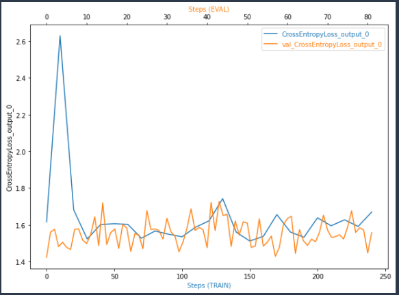

# Inventory-Monitoring-at-Distribution-Centers
Inventory Monitoring at Distribution Centers

## Domain Overview

Distribution centers form the critical part of a supply chain. Goods are transported in and out of these distribution centers to the destination such as wholesale, retail stores, customer warehouse etc. Goods transported need to be efficiently handled and this applies for almost all industries irrespective of products manufactured. In order to streamline the process, company employ inventory monitoring steps to make sure right goods are moved to the right place.

• Improving inventory monitoring will result in streamlining entire supply chain and also improves customer and vendor management and relationship for an organization
• In this context, this project focus on how to implement Machine Learning +Computer vision to modernize and improve the inventory monitoring process

## Problem Statement

Current setup in the company is based on manual process where the goods loading and movement and done by employees manually checking the assortment requirements and loading the cart. However, this process may lead to employee fatigue and low efficiency. In addition, there is possibility of error in loading goods based on correct quantity and type.

• This problem can be mitigated by using computer vision and Machine learning. Computer vision embedded in camera input can identify the objects / goods and can be integrated with Machine Learning based algorithm to identify various parameters such as count, type etc. This solution can be implemented as a solution framework which can be replicated.

• The efficiency of this solution can be tracked and measured using metrics such as accuracy, F1 score etc. Which is explored further in Evaluation Metrics section. Thus, the solution is measurable. The efficiency can also be measure by tracking the quantity of the good handled per day or per measuring time scale

## Overview of Dataset and Inputs used

Data can be downloaded from Amazon Open Data website https://registry.opendata.aws/amazon-bin-imagery/
• Data is captured by Amazon in their Fulfilment centre and has around 500000 images

Images are located in the bin-images directory, and metadata for each image is located in the metadata directory. Images and their associated metadata share simple numerical unique identifiers.

Images for the model, which is available in the source as JPEG file
Example
https://aft-vbi-pds.s3.amazonaws.com/bin-images/523.jpg
2. JSON format with meta data for the image
Example https://aft-vbi-pds.s3.amazonaws.com/metadata/523.json.

**From the JSON file, we can filter the target label which the quantity of the objects in the image**

License
Creative Commons Attribution-NonCommercial-ShareAlike 3.0 United States (CC BY-NC-SA 3.0 US) https://creativecommons.org/licenses/by-nc-sa/3.0/us/

## Project Setup

In this project AWS cloud platform will be used for model training and deployment
• AWS Sagemaker is a dedicated services for machine learning model training purpose and this will be used to train the deep learning model
• S3 will be used for data storage and training model storage
• Model will be deployed using Endpoint services in AWS

## Algorithm

Algorithm that will be used as part of the solution is based on Convolution Neural Network architecture where the images are feed into the network to train the model and will be used for final classification based on the quantity of the goods in the image.
• PyTorch Deep Learning Framework will be used
• AWS Sagemaker instance will be initiated and image that is stored in S3 bucket will be used as part of data pipeline.
• Model will be tuned and model with best hyper parameter will be identified and deployed

## Platform
• In this project AWS cloud platform will be used for model training and deployment
• AWS Sagemaker is a dedicated services for machine learning model training purpose and this will be used to train the deep learning model
• S3 will be used for data storage and training model storage
• Model will be deployed using Endpoint services in AWS
Optimal Sagemaker instance will be selected based on resource requirement and cost factor into consideration

## Solution requires following components
- Image Source (Camera)
- Algorithm to process the image – Convolutional Neural Network model
- Platform – Cloud

## Benchmark 

• Following result from silverbottlep is taken as benchmark result for model training https://github.com/silverbottlep/abid_challenge
• The author has achieved an overall accuracy score of 56 % (Approx.) which will be considered as benchmark and this experiment will focus to achieve this

## Model Performance and Result

